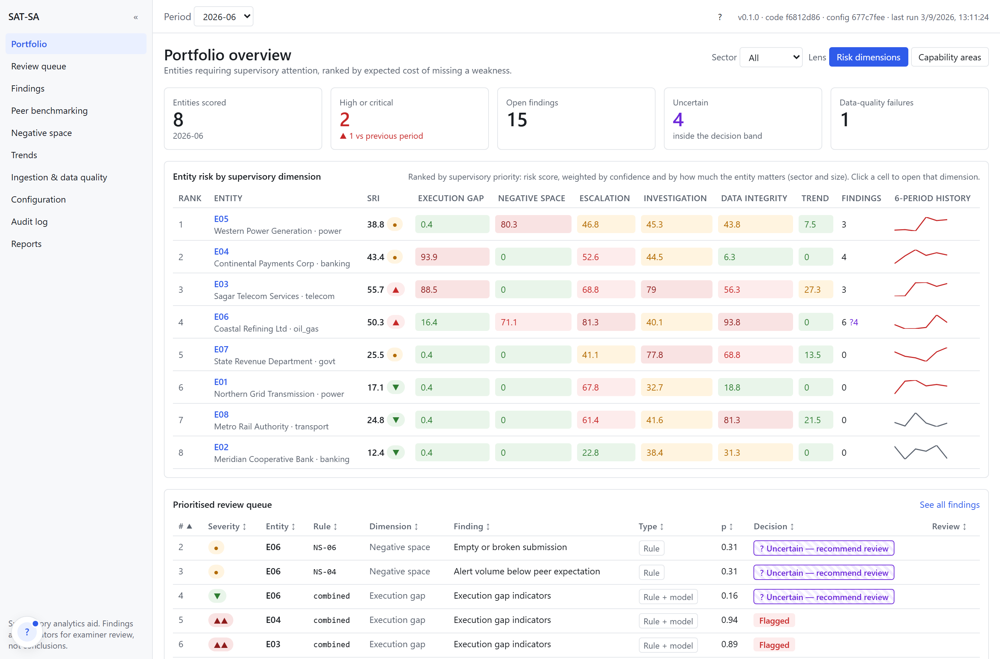
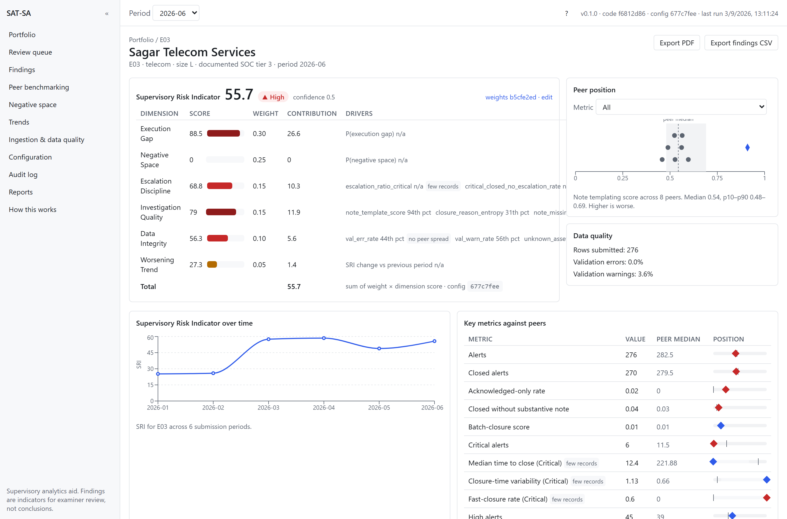
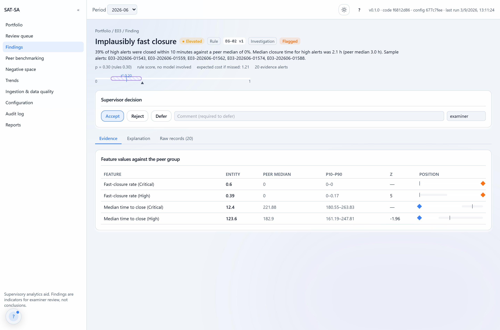
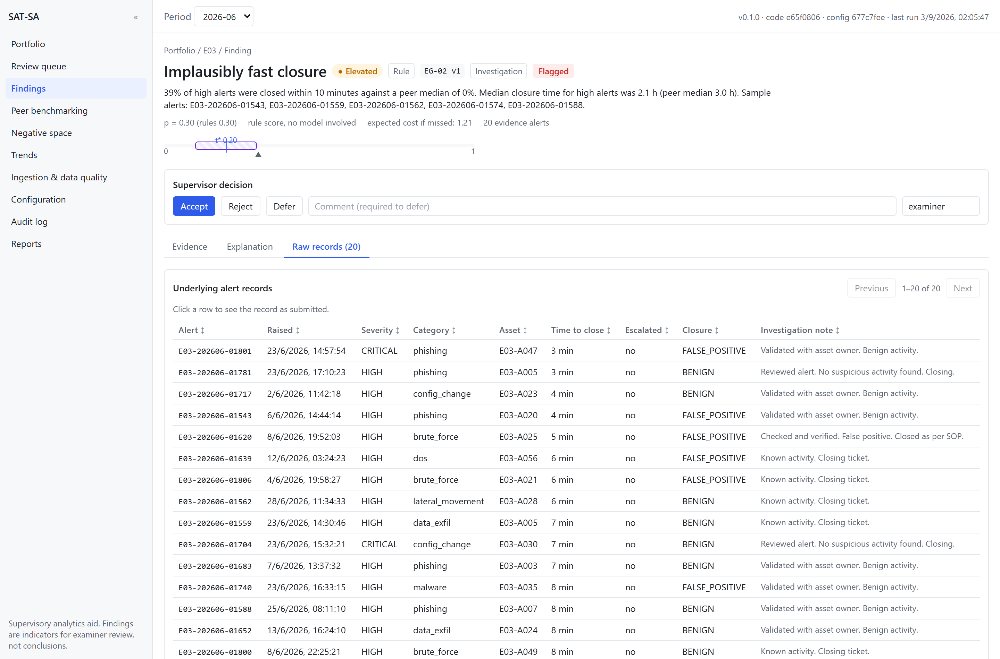
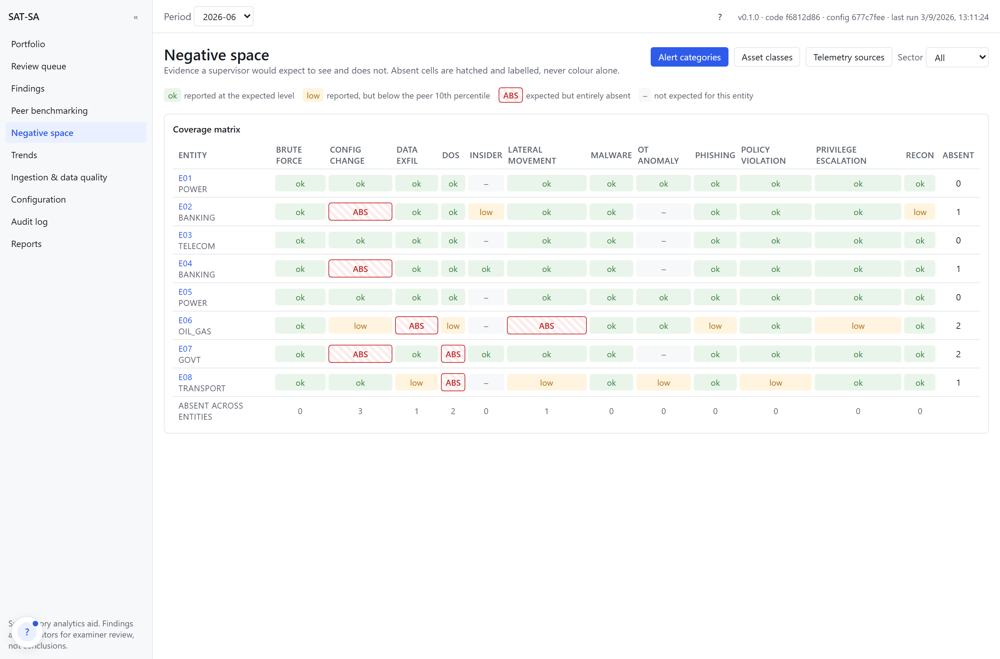
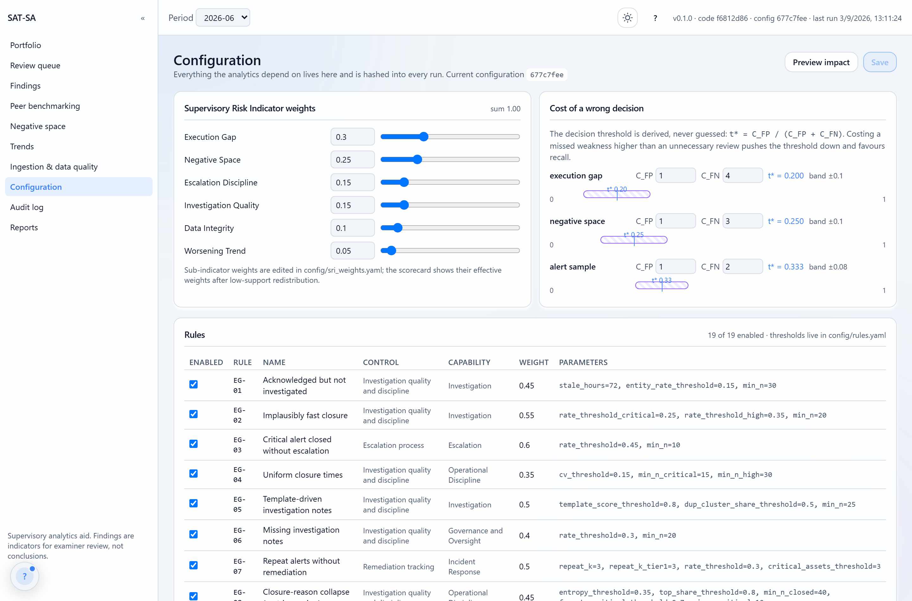
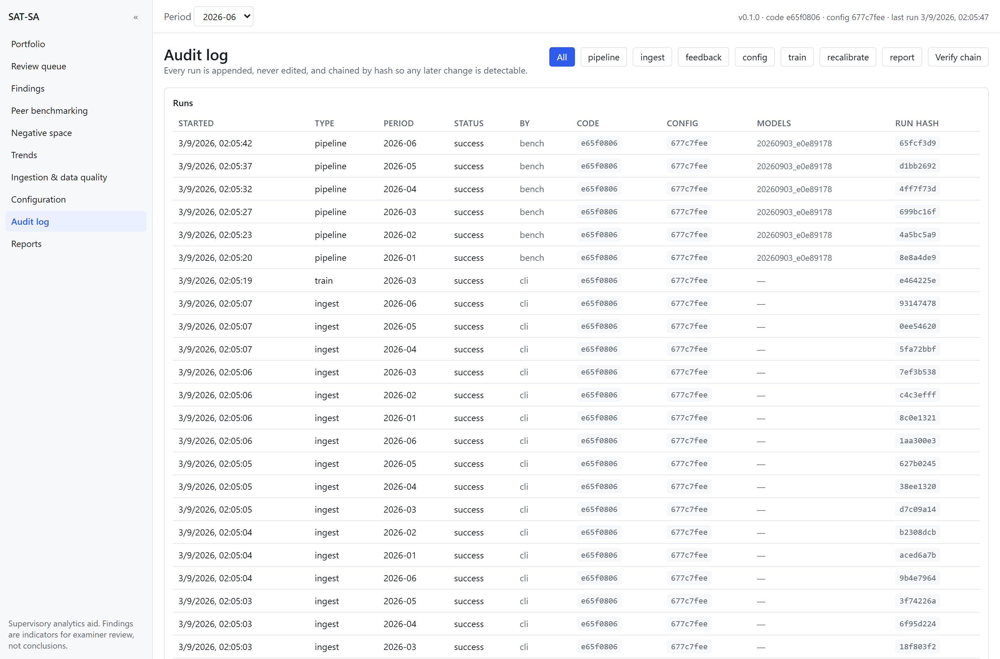
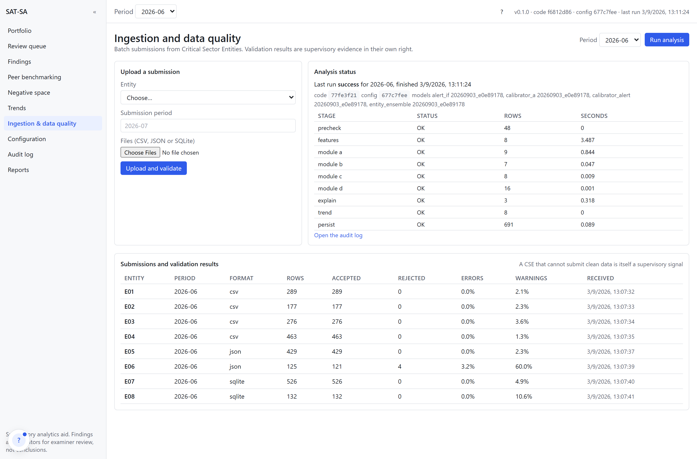

# SAT-SA

**Supervisory Analytics Tool for SOC Assessment**
*Evidence, not verdicts*

Team - Revenant

SIH 2026 · Problem Statement **SIH26157** · National Technical Research Organisation / NCIIPC

NCIIPC examiners judge whether a Critical Sector Entity's Security Operations Centre
actually works by reading samples of its alert and case-management records. Policies and
KPI dashboards say the SOC is effective; the records sometimes say otherwise. A critical
alert closed in ninety seconds as a false positive, an investigation note that appears
verbatim on four hundred other alerts, a Tier-1 asset that stopped reporting three months
ago and nobody noticed. That reading is accurate and does not scale.

SAT-SA reads those submissions at portfolio scale and hands an examiner a short, ranked,
evidenced list of where to look. It finds **Execution Gaps**, where documented capability
is not matched by operational evidence, and **Negative Space**, where evidence that should
exist is absent. Every finding carries the peer comparison that produced it and the alert
records that evidence it.

SAT-SA is a supervisory analytics aid. It is not a SOC, not a SIEM, and it decides nothing:
it produces indicators for a human examiner, and the review queue is sorted so the pairs it
was least able to decide come first.

Everything runs **offline on a laptop**. No cloud, no API keys, no hosted model, and the
test suite fails if any code opens a non-loopback socket.

---

## Run it

Needs Python 3.12 and Node 22 or newer. Python 3.14 is the default on many machines and
scikit-learn wheels are unreliable there, so the virtual environment pins 3.12; the Docker
image pins 3.11.

```bash
py -3.12 -m venv .venv
.venv/Scripts/pip install -e ".[dev]"
.venv/Scripts/satsa demo      # 72 s: seed, ingest, train, score, narrate
.venv/Scripts/satsa serve     # API and dashboard on :8000
```

`satsa demo` builds a synthetic estate with known weaknesses, ingests it in three file
formats, trains the models on the first half of the history, scores every period, then
walks through what a supervisor would see and do. Every number it prints is read back from
the database rather than written into the script, and `tests/test_demo.py` asserts the
story it tells.

Or with Docker:

```bash
docker compose up
```

| URL | What |
|---|---|
| http://localhost:8000 | SAT-SA dashboard |
| http://localhost:8000/api/docs | API reference |
| http://localhost:8000/api/v1/health | Active models, code hash, config hash |

To prove every capability rather than read about it:

```bash
.venv/Scripts/satsa showcase       # 79 checks across 16 sections, exits non-zero on failure
.venv/Scripts/satsa showcase --ui  # also renders every dashboard route in a browser
```

`satsa demo` tells the twelve-minute story. `satsa showcase` executes every claim this
README makes: it tampers with a copy of the audit ledger to show the break being caught,
re-runs the pipeline to show identical inputs producing an identical output hash, records
two conflicting supervisor decisions to show both being kept, and previews a threshold
change before saving it. Nothing in its output is printed without being executed first.

`make help` lists every target. `make check` runs ruff and the 70 backend tests.

### Optional accelerators

SAT-SA runs at full function without these. Each one upgrades a component and each has a
working fallback that reports itself at `/api/v1/health`:

```bash
pip install "satsa[hdbscan]"   # adds a density detector to the Tier-2 ensemble
pip install "satsa[pdf]"       # weasyprint instead of reportlab
```

Neither is a hard dependency, deliberately: `hdbscan` needs a C compiler and `weasyprint`
needs cairo and pango, and an air-gapped installation should not fail on either. Without
`hdbscan` the ensemble runs two detectors instead of three and says so in the model
registry. **On the demo profile it is not installed**, so every number below is from the
two-detector configuration.

---

## Build status

Built against the approved implementation plan. Gaps are tracked honestly in
[`KNOWN_GAPS.md`](KNOWN_GAPS.md), including one that weakens the accuracy claims.

| Phase | Scope | Status |
|---|---|---|
| 0 | Scaffold, configuration, DuckDB store, CLI, test harness, Docker | **Done** |
| 1 | Canonical schema, 13 validation checks, three ingestion adapters, simulator | **Done** |
| 2 | 84 entity-period features with robust peer baselines | **Done** |
| 3 | 19 rules, anomaly ensemble, calibration, the four analytics modules | **Done** |
| 4 | Explainability, hash-chained audit, feedback loop, pipeline | **Done** |
| 5 | API, reports, dashboard | **Done** |
| 6 | Packaging, validation harness, documentation | **Partial.** the validation harness was specified and not built |
| 7 | Screenshots, frontend tests, accessibility audit | **Not started** |

---

## The screens

Ten routes. The dashboard is bundled locally, served by the API from the same origin, and
references no external host; `dashboard/scripts/check-offline.mjs` fails the build if it
ever does.

`dashboard/scripts/screenshots.py` regenerates every image below by driving the built UI in
a real browser against the running application, so none of them can drift from what it
actually renders. A step-by-step tour of every feature is in
[`docs/walkthrough.md`](docs/walkthrough.md).

| | |
|---|---|
|  |  |
| **Portfolio.** Eight entities ranked by supervisory priority, not by raw score. Every cell carries its number, so colour is never the only cue. | **Entity.** The risk indicator as arithmetic: score, weight and contribution per dimension, summing in front of you, with a confidence that says how much evidence it had. |
|  |  |
| **Finding.** One sentence with real numbers, the threshold it was measured against, and the evidence beside the peer band. | **Raw records.** The twenty alerts behind the claim. Three clicks from the portfolio. |
|  |  |
| **Negative space.** Expected evidence that is absent, hatched and labelled `ABS`. Click a cell for the three reasons it was expected. | **Configuration.** `t*` recomputes live as you change the cost of being wrong, and the impact is previewed before anything is saved. |
|  |  |
| **Audit.** 55 hash-chained runs, verifiable from the page. | **Ingestion.** Validation counts down to the individual check, because dirty submissions are themselves a finding. |

| Route | What it shows |
|---|---|
| `/portfolio` | Five KPI tiles, an entity by dimension risk heatmap with a toggle to the eight PS capability areas, and the top of the review queue. Rank is supervisory priority, not raw score. |
| `/entities/:id` | The risk indicator shown as arithmetic: every dimension with its score, weight and contribution, summing to the total. Peer position, six-period trend, headline metrics against the peer band, control priorities, findings. |
| `/findings/:id` | One-line reason first. Then evidence against peers, the rule template with its evaluated values or the model attribution, and the raw alert records. Accept, reject or defer with a comment. |
| `/queue` | Three scopes: alert samples, entity findings, controls and processes. Uncertain items first, because those are the ones the tool could not decide. |
| `/peer` | Distribution of any metric across the peer group with the selected entity marked, and a rank table with percentiles. |
| `/coverage` | Negative space as a matrix of entity against expected category, asset class or telemetry source. Absent cells are hatched and labelled `ABS`, never colour alone. |
| `/trends` | Risk across submission periods, per entity, per dimension and per control. |
| `/ingestion` | Upload, per-submission validation counts down to the check level, and the pipeline stage log. |
| `/config` | The weights, and the costs with `t* = C_FP / (C_FP + C_FN)` recomputing live as you change them. Preview the effect on every entity before saving. |
| `/audit` and `/reports` | The hash-chained run log with a verify button, the model registry, and PDF or CSV export. |

The path from portfolio to raw records is three clicks: heatmap cell, finding row, records
tab.

---

## Demo script

Twelve minutes, in order. Every number below is what a freshly seeded `satsa demo` actually
produces on seed 42.

**0 · Before they arrive (2 min).** `satsa demo` takes 72 seconds, then `satsa serve`.
Leave the browser on `/portfolio` with the period set to `2026-06`.

**1 · The problem (90 s).** Portfolio. Eight entities, ranked.

> "Eight Critical Sector Entities submitted alert and case data for this period. An
> examiner has time to read one, maybe two. Which two?"

Point at the heatmap. E03 scores 55.7 and E06 50.3, both HIGH. E01, E02 and E08 are LOW.

> "The tool has not decided anything yet. It has said where to spend the afternoon."

**2 · Why E03 (2 min).** Click E03. The scorecard is arithmetic, not a verdict:

| Dimension | Score | Weight | Contribution |
|---|---|---|---|
| Execution Gap | 88.5 | 0.30 | 26.6 |
| Negative Space | 0.0 | 0.25 | 0.0 |
| Escalation Discipline | 68.8 | 0.15 | 10.3 |
| Investigation Quality | 79.0 | 0.15 | 11.9 |
| Data Integrity | 56.2 | 0.10 | 5.6 |
| Worsening Trend | 27.3 | 0.05 | 1.4 |
| **Total** | | | **55.7** |

> "Every row is a peer percentile in the risky direction, so this is scale-free. The column
> adds up in front of you. The weights are on the configuration screen, not buried in code,
> and the hash of those weights is recorded with the score."

Confidence reads 0.50, and that is worth pointing at rather than glossing.

> "Half the sub-indicators had too few records to compare, so they were dropped and their
> weight redistributed. The score is still 55.7, but the tool is telling you it is working
> from half the evidence it would like."

**3 · From claim to evidence (2 min).** Open the EG-02 finding. Read its rationale verbatim:

> "Thirty-nine per cent of high alerts were closed within ten minutes, against a peer median
> of zero per cent. Median closure time for high alerts was 2.1 hours; the peer median is
> 3.0 hours."

Evidence tab: the feature values beside the peer median, the p10 to p90 band, the z-score.
Records tab: twenty alerts, sorted by closure time.

> "Three minutes, critical, closed as a false positive. The note reads *Validated with asset
> owner. Benign activity.* The next one reads *Reviewed alert. No suspicious activity found.
> Closing.* Those notes are near-identical across the entity, which is what EG-05 flags
> separately."

**4 · Where it refuses to guess (2 min).** Queue, uncertain first.

> "Sixteen findings this period. Twelve the tool flagged, four it would not decide. Those
> four are at the top of the queue, not the bottom."

Open one. Point at the threshold line.

> "The threshold is not tuned to a target. It comes from the cost of being wrong. Missing a
> real weakness is costed four times an unnecessary review, so t* is 0.20. Anything within
> a band of that goes to a person. Change the cost on the configuration screen and the
> threshold follows."

**5 · Evidence that is not there (2 min).** Coverage.

> "This is the harder half. Everything so far was in the data. This is what should have been
> and is not."

E06's row: `lateral_movement` and `data_exfil` hatched and labelled ABS. Click the cell.

> "Expected for an oil and gas entity, expected again because they declare domain
> controllers, and reported by seven of the eight peers this period. Observed: zero alerts.
> Either they cannot detect lateral movement, or they can and did not report it. Both are
> supervisory findings."

E05's row, then the finding behind it:

> "Six of sixteen Tier-1 assets produced no alerts this period, and all six were reporting
> in at least two of the previous five. That is a 38% silent-asset rate against a peer
> median of zero. Nothing detected an intrusion there, because nothing was watching."

**6 · Data quality is a finding (90 s).** Ingestion, E06.

> "Their February submission: 118 rows, and 25 of them reference assets that are not in
> their own inventory, 55 have no investigation note, three are duplicate alert IDs. We do
> not discard those rows. An entity that cannot submit clean data is telling you something,
> so the failure rates feed the data integrity dimension and rule NS-06."

**7 · Governance (2 min).** Audit, then Verify chain.

> "Fifty-five runs: forty-eight ingests, six scoring runs, one training run. Each records
> the code hash, the configuration snapshot, the model versions, the input manifest and the
> output hash, chained to the previous run."

Press verify.

> "Intact. Edit any row behind the tool's back and this reports the first break. And a
> forced re-run of a period reproduces the same output hash, which the test suite asserts."

**8 · If they ask what happens next (60 s).** Accept a finding on the finding page.

> "That decision is appended, never overwritten. It becomes a label the calibrator learns
> from, and it drives per-rule precision with bounded threshold suggestions. None of which
> activate until a person promotes them."

### If something goes wrong

- **Data in a strange state:** `satsa demo` rebuilds everything in 72 seconds.
- **API died:** `satsa serve`. The dashboard says so rather than showing stale numbers.
- **Asked for a fresh ingest:** the ingestion screen takes a CSV end to end on top of the
  existing state. Do not re-run the whole demo mid-presentation.

### Questions they will ask

| Question | Answer |
|---|---|
| "How do you know it's right?" | Partly. The seeded weaknesses are found and the healthy and noisy controls produce no automatic flags. But the thresholds were tuned against the same data, so this is not a held-out result. It is the first thing in `KNOWN_GAPS.md`. |
| "Is this machine learning deciding?" | No. Nineteen deterministic rules produce the findings and their rationales. The model adds a second opinion whose score is calibrated before anyone sees it, and it never produces a finding on its own. |
| "Where does the threshold come from?" | The cost of being wrong. `t* = C_FP / (C_FP + C_FN)`, set by the supervisor on the configuration screen. Not tuned to maximise a metric. |
| "What if it's wrong?" | Nothing is irreversible. Every finding is inspectable to the record level, every decision is appended and auditable, and the uncertain band exists precisely so borderline cases reach a person. |
| "Does it need the internet?" | No, and the test suite enforces it: an autouse fixture fails any test that opens a non-loopback socket. |
| "Does it scale?" | Measured to 14,704 alerts in 72 seconds on one laptop core at 0.33 GB. Beyond that it is untested and the docs no longer claim otherwise. |

---

## Data

`satsa seed` builds a synthetic estate with full ground truth, reproducibly from a fixed
seed. Nothing in the application reads the truth tables.

| | Demo profile |
|---|---|
| Entities | 8 across power, oil and gas, telecom, banking, transport, government |
| Submission periods | 6 |
| Submissions | 48 · 24 CSV, 12 JSON, 12 SQLite |
| Alerts generated | 14,729 |
| Alerts accepted | 14,704 · 25 rejected as unparseable or duplicate |
| Assets | 545 · escalations 1,480 · incidents 372 |
| Seed | **16.3 s** |
| Ingest, all 48 submissions | **16.7 s** |
| Train, three periods | **12.3 s** |
| Score, six periods | **27.3 s** · slowest period 5.4 s |
| **Full pipeline** | **72.5 s** |
| Peak resident memory | **0.33 GB** |
| Database on disk | 14 MB · synthetic sources 8.3 MB · models 3.2 MB |

Three export formats are generated deliberately, so every ingestion adapter is exercised on
every run rather than only the one a developer happened to test.

Eight entity profiles carry known behaviour:

| Entity | Profile | Seeded behaviour |
|---|---|---|
| E01, E02 | Healthy | Nothing injected |
| E03 | Execution gap | Fast closures, template notes, unescalated criticals, from period 3 |
| E04 | Execution gap | Acknowledged and abandoned, repeat alerts without remediation, closure-reason collapse |
| E05 | Negative space | Six Tier-1 assets go silent from period 4, one telemetry source drops out |
| E06 | Negative space | Two expected categories absent, volume 45% below peer expectation, dirty data |
| E07, E08 | Noisy controls | High volume with high false-positive rate, and highly variable closure times, but sound process. **Must not be flagged.** |

Endpoint latency, warm, median of five on the demo profile:

| Endpoint | Latency |
|---|---|
| Audit stream | 11 ms |
| Peer benchmark | 16 ms |
| Summary | 27 ms |
| Findings list | 30 ms |
| Review queue | 56 ms |
| Trends | 61 ms |
| Coverage matrix | 62 ms |
| Entity heatmap | 70 ms |
| Entity detail | 95 ms |

---

## What is measured, and what is not

This section is shorter than it should be, and the reason is worth stating plainly rather
than burying.

**What is measured and holds.**

| | Result |
|---|---|
| Seeded weaknesses found, latest period | E03 → EG-02, EG-05 · E04 → EG-01, EG-07, EG-10 · E05 → NS-01, NS-02 · E06 → EG-06, NS-03, NS-04, NS-06 |
| Healthy and noisy controls auto-flagged | **0** for E01, E02, E07, E08 |
| Rule specificity | Each of the 14 rules that fire, fires on exactly one entity |
| Execution-gap calibrator | ECE **0.009**, Brier **0.028** on 24 labelled entity-periods |
| Alert calibrator | ECE **0.0003**, Brier **0.091** on 7,379 labelled alerts |
| Pipeline reproducibility | A forced re-run produces an identical output hash, asserted in `test_pipeline.py` |
| Audit integrity | 55 runs chained and verifying; tampering is detected at the right sequence number |
| Offline guarantee | Enforced by an autouse fixture that fails on any non-loopback socket |
| Backend tests | **70** across 9 files |

**What is not measured, and should be.** Four gaps, worst first, all in
[`KNOWN_GAPS.md`](KNOWN_GAPS.md):

1. **There is no held-out split.** Rule thresholds in `config/rules.yaml` were tuned while
   observing which entities flagged, and the results above come from that same data. A
   precision or recall figure computed this way would overstate itself, so none is quoted.
   The fix is a tuning split and a reporting split, which the implementation plan called for.
2. **Ground truth is generated and not graded against.** The simulator writes
   `expected_findings.csv` naming which rule should fire for which entity-period. Nothing
   reads it. Per-rule precision and recall are computable today and are not computed.
3. **There is no baseline.** What a naive approach achieves on this data is unknown, so the
   lift is unquantified.
4. **Five of nineteen rules never fire** on the demo profile: EG-04, EG-08, EG-09, EG-11 and
   NS-08. Either the simulator does not produce those patterns or the thresholds are too
   tight, and which of the two has not been established.

An averaged headline number would have hidden all four. That is why there is not one.

### The threshold comes from cost, not from tuning

Most systems pick a threshold that maximises a metric. That optimises the wrong thing for a
supervisor, because the two errors are not equally expensive. Flagging a healthy entity
costs an examiner some hours. Missing a real weakness costs considerably more.

So the threshold is derived: `t* = C_FP / (C_FP + C_FN)`. Costing a missed execution gap at
four times an unnecessary review gives `t* = 0.200`; negative space at three times gives
`0.250`; alert samples at two times give `0.333`. The costs sit in `config/costs.yaml` and
on the configuration screen, where changing them recomputes the threshold live and previews
how many findings would move.

Findings within a band around `t*` are never auto-decided. They are marked *uncertain,
recommend review* and sorted to the top of the queue, because that band is exactly where the
tool should defer. On the latest period, four of sixteen findings land there.

### Rules first, model second

Nineteen deterministic rules produce every finding and its rationale. The unsupervised
ensemble is a second opinion; it never produces a finding alone.

That ordering is a supervisory requirement, not a preference. A rule can be read by the
person it is used against. `EG-03` fires when critical alerts are closed without escalation
above a configured rate, and it renders a sentence naming the count, the rate, the dominant
closure reason and the peer median. An examiner can disagree with the threshold, and an
entity can contest the finding on its merits. Neither is possible against a score.

The ensemble runs IsolationForest and Local Outlier Factor, with HDBSCAN when it is
installed. Raw anomaly scores are not probabilities, so an isotonic calibrator maps them
before anyone sees one. **With fewer than the configured minimum of labels, the raw score
passes through unchanged and every affected finding is marked uncalibrated in the
interface** rather than being quietly presented as a probability. The rule layer and the
model are combined with a geometric noisy-OR weighted toward the rules, and within a
control the maximum is taken rather than the noisy-OR, so several correlated rules cannot
inflate one another.

### Negative space is the harder half

Finding what is in the data is comparatively easy. Finding what should be there and is not
requires a model of what to expect.

Six deterministic detectors: a peer expected-volume model using Huber regression, expected
categories absent by sector and asset mix, telemetry coverage gaps, Tier-1 assets that were
reporting and stopped, missing escalation or investigation records, and unexplained drops
in activity.

The expectation is always justified on screen. E06 is missing `lateral_movement`, and the
coverage cell gives three independent reasons: expected for the oil and gas sector, expected
because the entity declares domain controllers, and reported by seven of the eight peers
this period. An expectation a supervisor cannot interrogate is not evidence.

### Peer comparison, and small groups

Every metric is compared inside a group of the same sector and size band, using a median and
median absolute deviation so one outlier cannot move the baseline. When a group is too small
to compare against, the comparison falls back to a wider one and **records which level it
used**.

Thin evidence is never silently treated as a signal. Every feature carries its sample size
and a support flag. Sub-indicators with weak support are dropped from the risk indicator and
their weight redistributed, which lowers the confidence reported beside the score rather
than producing a confident number from nothing.

### Explainability

Rule findings render a template with their evaluated values. Model findings carry SHAP over
the isolation forest where the library is present, and a peer z-score attribution where it
is not, **and the finding records which method produced it**.

Every explanation names the two features whose return to the peer median would most reduce
the score. That is the question an entity actually asks after being flagged, and answering
it is the difference between a finding and an accusation.

### Audit and reversibility

Every ingest, training run, scoring run, configuration change, feedback decision and report
appends a row recording the code hash, configuration snapshot, model versions, input
manifest and output hash, chained to the previous run. Editing any row behind the tool's
back breaks the chain, and `GET /api/v1/audit/verify` reports where.

Command-line use is audited identically to API use. That was not true at first: ingestion
and training recorded audit rows only when driven through the API, so a supervisor working
from the shell left no trail. The audit event now lives in the ingestion and training
functions themselves, which is the only place it cannot be forgotten.

Supervisor decisions are appended, never overwritten. They become labels for the calibrator
and drive per-rule precision with bounded threshold suggestions, none of which activate
without an explicit promotion.

---

## Problem-statement traceability

Every capability named in SIH26157, and where it lives. Partial is marked partial.

| PS-stated capability | Where it lives | Status |
|---|---|---|
| Ingest structured data from multiple CSEs | `satsa/ingest/` | **Done.** CSV, JSON and SQLite adapters, YAML column mapping, unmapped columns reported |
| Support common formats including database exports | three adapters, all exercised every run | **Done.** API pull is not implemented; the PS says "where available" |
| Analyse large datasets across entities and periods | `satsa/features/`, `satsa/pipeline/` | **Done** at 14,704 alerts across 8 entities and 6 periods. Larger volumes untested |
| Identify detection, investigation and escalation weaknesses | 11 execution-gap rules | **Done.** each renders a rationale naming its evidence and the peer comparison |
| Detect potential execution gaps | `module_a_execution.py` | **Done.** rules plus a calibrated ensemble, combined toward the rules |
| Detect potential negative space | `module_b_negative.py` | **Done.** six deterministic detectors, expectation justified on screen |
| Identify anomalies, outliers, suspicious patterns | IsolationForest and LOF over 84 features | **Done.** calibrated before display, marked uncalibrated when labels are thin |
| Peer comparison and benchmarking | `module_c_benchmark.py`, `/peer` | **Done.** sector and size band, median and MAD, documented fallback |
| Entity-level supervisory risk indicators | six-dimension scorecard | **Done.** shown as arithmetic with weights, contributions and a confidence |
| Prioritise entities, controls, processes and alert samples | `module_d_prioritise.py`, `/queue` | **Done.** all four scopes; samples drawn round-robin across rules |
| Clear rationale for findings | Jinja templates per rule, SHAP or z-score for the model | **Done** |
| Present supporting evidence | evidence tab and raw records | **Done.** three clicks from the portfolio |
| Traceability and auditability | hash-chained `audit_runs` | **Done.** tamper-evident, verifiable from the UI, covers CLI and API alike |
| Understand why an entity was flagged | rationale, peer comparison, counterfactual | **Done** |
| Dashboards and reports | 10 routes, PDF and CSV | **Done.** exports stamped with the hashes that produced them |
| Trend analysis across entities and periods | `/trends` | **Done.** per entity, per dimension, per control |
| Drill-down from finding to evidence | `/findings/:id` records tab | **Done** |
| Air-gapped, no cloud, no hosted model | classical scikit-learn only | **Done.** enforced by a test, not by a promise |
| Specify architecture, hardware, update mechanism | `docs/model_card.md` | **Done** |
| Explainability and auditability controls | above | **Done** |
| Validation against expert manual review | `validation/` | **Not built.** the plan specified a backtest, a calibration check and a parity protocol; the directory is empty |

---

## Built with

Python 3.12, DuckDB, FastAPI, pandas, scikit-learn, SHAP, reportlab. React 18, TypeScript,
Vite, TanStack Query and Table, Recharts, Tailwind. The dashboard bundles to 788 KB of
JavaScript and 20 KB of CSS with no external asset of any kind.

**No language model and no external AI service.** A grep for `openai`, `anthropic`,
`transformers`, `torch` and the rest finds nothing in `satsa/` or `simulator/`. That is a
requirement of the problem statement, and meeting it is why the analytics are classical.

The dependency tree contains no GPL or AGPL package, verified with `pip-licenses`. This is
worth checking rather than assuming: the optional `hdbscan` accelerator is BSD, but
adjacent tooling in this space is not, and a copyleft dependency in a government
deployment is a procurement problem rather than a technical one.

## Documentation

- [`docs/architecture.md`](docs/architecture.md) — system design, data flow, deployment
- [`docs/model_card.md`](docs/model_card.md) — models, hardware, training, update mechanism, known limitations
- [`docs/walkthrough.md`](docs/walkthrough.md) — local setup from nothing, then every feature screen by screen
- [`KNOWN_GAPS.md`](KNOWN_GAPS.md) — what is not done, and what is claimed more strongly than the evidence supports
