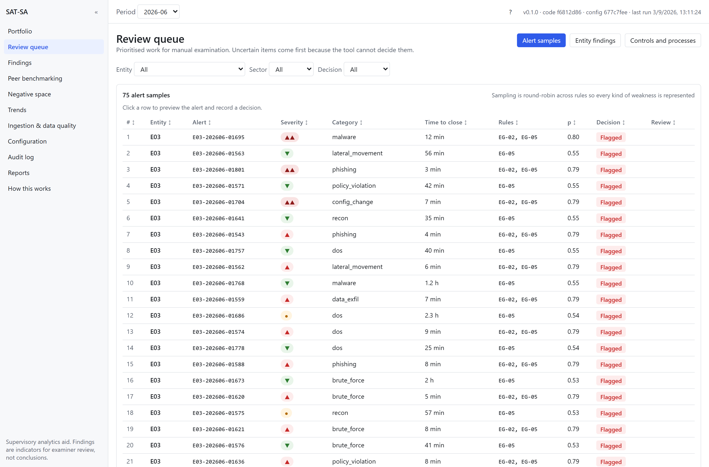
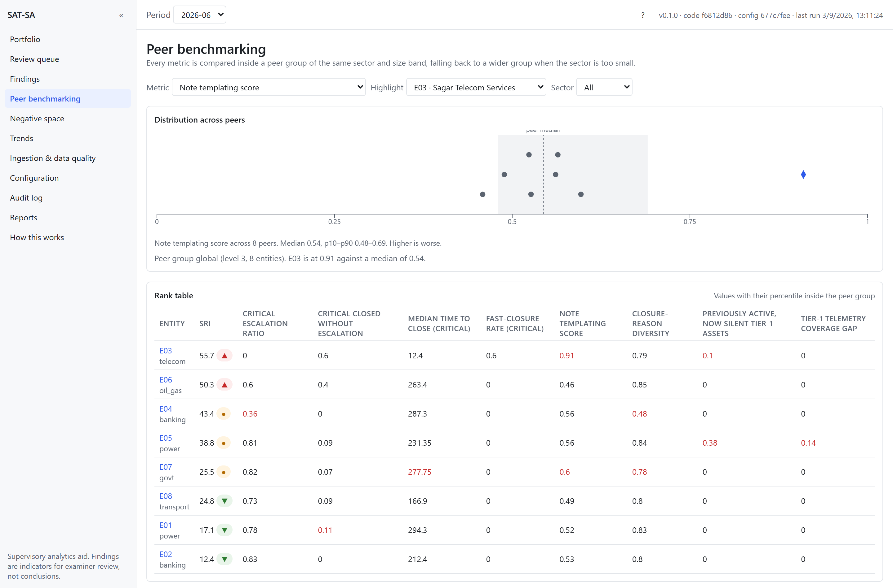
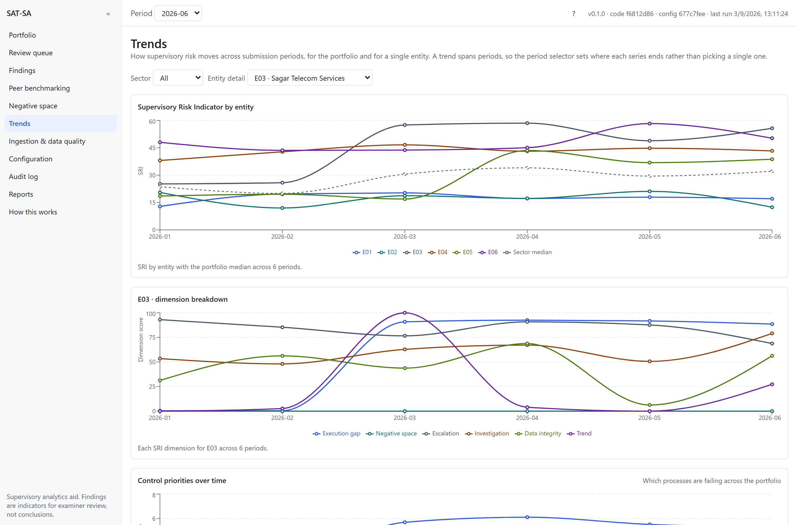
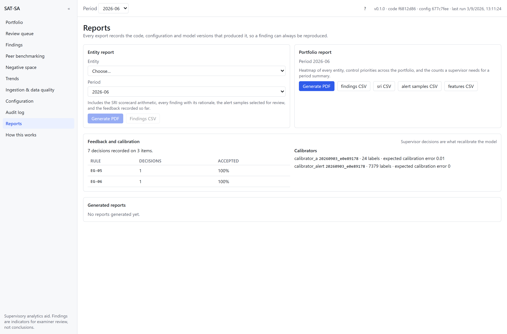
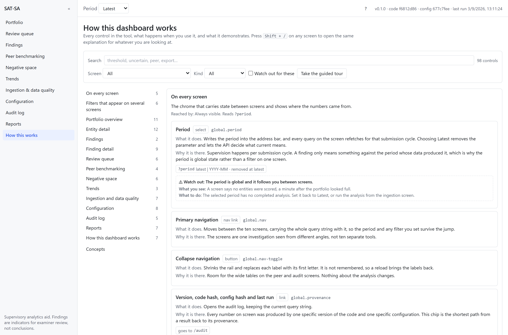
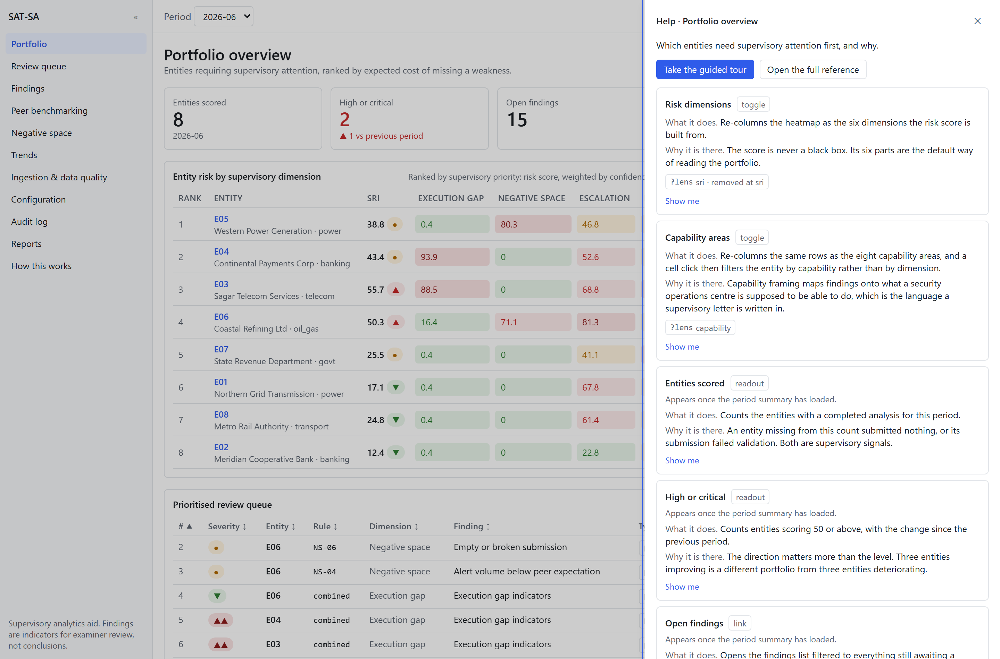

# SAT-SA — Setup and full feature walkthrough

Part 1 gets it running on your machine from nothing. Part 2 walks every screen and every
feature, in the order a supervisor would meet them, saying what to click and what you will
see.

Every figure quoted here was read from a live instance on seed 42. If a number on your
screen differs, you are on a different seed or a different period, not a different build.

---

# Part 1 · Setup

## 1.1 What you need

| | Version | Why that version |
|---|---|---|
| Python | **3.12** | scikit-learn and SHAP wheels are unreliable on 3.14, which is the default on many machines. The Docker image pins 3.11. |
| Node | 22 or newer | Only needed to rebuild the dashboard. A prebuilt bundle is committed, so you can skip Node entirely. |
| Disk | ~600 MB | Virtual environment, dependencies, demo data and models |
| Network | none at runtime | Needed once to install packages. After that nothing reaches out. |

Check what you have:

```bash
py -0p            # Windows: lists installed Pythons
python3 --version # macOS / Linux
node -v
```

## 1.2 Install

```bash
git clone https://github.com/devprashant19/SIH_2026.git
cd SIH_2026

# Windows
py -3.12 -m venv .venv
.venv\Scripts\pip install -e ".[dev]"

# macOS / Linux
python3.12 -m venv .venv
.venv/bin/pip install -e ".[dev]"
```

`-e` installs in editable mode so your edits take effect without reinstalling. `[dev]`
adds pytest, httpx and ruff.

Confirm it worked. This prints the version identifiers and, importantly, the derived
decision thresholds, which proves the configuration parsed:

```bash
.venv/Scripts/satsa info
```

```
satsa 0.1.0  rules=r1  features=f1
code_hash    e65f0806...
config_hash  677c7fee...
weights_hash b5cfe2ed...
t*[execution_gap] = 0.200  band ±0.10
t*[negative_space] = 0.250  band ±0.10
t*[alert_sample] = 0.333  band ±0.08
```

Those three thresholds are not typed in anywhere. They are computed from the costs in
`config/costs.yaml`. Part 2.9 shows you changing them.

## 1.3 Build the demo estate

One command does everything and narrates it:

```bash
.venv/Scripts/satsa demo
```

Roughly 72 seconds, in five phases:

| Phase | Time | What happens |
|---|---|---|
| Seed | 16.3 s | Generates 8 synthetic entities across 6 monthly periods: 14,729 alerts, 545 assets, 1,480 escalations, 372 incidents, written as 24 CSV files, 12 JSON documents and 12 SQLite databases |
| Ingest | 16.7 s | Reads all 48 submissions through three adapters, runs 13 validation checks, accepts 14,704 rows and rejects 25 |
| Train | 12.3 s | Fits the anomaly ensemble and both calibrators **on the first three periods only** |
| Score | 27.3 s | Runs the ten-stage pipeline over all six periods |
| Narrate | — | Prints twelve steps of what a supervisor would see |

The train-on-early-periods split matters: periods 4 to 6 are scored by models that never
saw them.

If you prefer the steps separately:

```bash
.venv/Scripts/satsa init-db                                   # create the DuckDB store
.venv/Scripts/satsa seed                                      # generate the estate
.venv/Scripts/satsa ingest data/synthetic                     # ingest all 48 submissions
.venv/Scripts/satsa train --periods 2026-01,2026-02,2026-03 --promote
.venv/Scripts/satsa run 2026-06                               # score one period
.venv/Scripts/satsa verify-audit                              # check the audit chain
```

## 1.4 Start it

```bash
.venv/Scripts/satsa serve
```

Open **http://localhost:8000**. The API serves the dashboard from the same origin, so
there is no second server and no CORS to configure.

| URL | What |
|---|---|
| http://localhost:8000 | Dashboard |
| http://localhost:8000/api/docs | Interactive API reference |
| http://localhost:8000/api/v1/health | Active models, code hash, configuration hash |

## 1.5 Docker instead

```bash
docker compose up --build
```

Builds the dashboard with Node, installs the Python package, and serves both from one
image. To prove the air-gap, uncomment `network_mode: none` in `docker-compose.yml` and
start it again; nothing breaks.

## 1.6 Verify the install

```bash
.venv/Scripts/python -m pytest -q        # 70 tests
```

The suite includes an autouse fixture that fails any test opening a non-loopback socket,
so a green run is also evidence the offline guarantee holds.

To rebuild the dashboard after changing it:

```bash
cd dashboard
npm install
npm run build
node scripts/check-offline.mjs      # fails if the bundle references any external host
```

## 1.7 If something goes wrong

| Symptom | Cause and fix |
|---|---|
| `satsa` not found | The virtual environment is not active. Use the full path `.venv/Scripts/satsa`. |
| scikit-learn fails to install | You are on Python 3.13 or 3.14. Recreate the environment with 3.12. |
| Dashboard shows a 503 JSON message | The bundle is not built. `cd dashboard && npm install && npm run build`. |
| Every screen is empty | No pipeline has run. `satsa run 2026-06`, or `satsa demo` to rebuild everything. |
| "a job is already running" (HTTP 409) | DuckDB allows one writer. Wait for the current run, or check `/api/v1/pipeline/status`. |
| Data in a strange state | `satsa demo` rebuilds everything in 72 seconds. |

---

# Part 2 · Feature walkthrough

Set the period selector at the top to **2026-06** and start on Portfolio. Every figure
below is what that period actually shows.

> **The tool also explains itself.** Everything in this part is available inside the running
> application, next to the controls it describes. Press `Shift` + `/` on any screen for a panel
> covering the controls in front of you, open **How this works** in the navigation for the full
> searchable reference, or take the nine-step guided tour. This document is the version you can
> read without starting the server. See [2.15](#215-the-in-app-guide).

## 2.1 The shell

Present on every screen:

- **Navigation rail**, eleven routes, collapsible with the `«` button. A skip link precedes
  it for keyboard users. The last route, **How this works**, is the guide to the other ten.
- **Period selector**, top left. It writes to the URL as `?period=2026-06`, so every view is
  deep-linkable and the browser back button works properly.
- **Provenance chip**, top right: `v0.1.0 · code e65f0806 · config 677c7fee · last run …`.
  Click it to jump to the audit log. This is the answer to "which version produced what I am
  looking at", visible without asking.
- **Help button** (`?`), top right beside the provenance chip, or `Shift` + `/` from
  anywhere outside a text field. Opens a panel describing every control on the screen you are
  currently looking at.
- **Footer note**: *Supervisory analytics aid. Findings are indicators for examiner review,
  not conclusions.* Deliberately always on screen.

## 2.2 Portfolio overview


**Five KPI tiles.** Entities scored 8, high or critical 2 with a `▲1 vs previous period`
delta, open findings 16, uncertain 4, data-quality failures 1. Each tile is a link into the
filtered view behind it, so "uncertain 4" takes you to those four findings.

**The heatmap.** One row per entity, ranked. Columns are the six risk dimensions, then the
findings count, then a six-period sparkline.

Two things to notice, because both are deliberate:

- **Rank is not the score order.** E05 is rank 1 with an indicator of 38.8, while E03 sits at
  rank 3 with 55.7. Rank is supervisory priority: the score weighted by confidence and by how
  much the entity matters, since E05 is an extra-large power entity and E03 a large telecom
  one. The column header says so on hover.
- **Every cell carries its number.** Colour is a secondary cue, never the only one, so the
  table is readable in greyscale and by colour-blind users.

Click any cell to open that dimension for that entity. Click an entity name to open it whole.

**Lens toggle**, top right. Switches the columns from the six risk dimensions to the eight
capability areas the problem statement names: Threat Detection, Investigation, Escalation,
Incident Response, Security Operations, Governance and Oversight, Operational Discipline,
Cyber Resilience. Same data, expressed in the assessment vocabulary rather than the tool's.

**Prioritised review queue**, below. Uncertain items first: four E06 findings the tool would
not decide, then the flagged ones. That ordering is the whole philosophy in one table.

## 2.3 Entity detail


Open E03, Sagar Telecom Services.

**The scorecard is arithmetic, not a verdict.** Six rows, each with its score, its weight and
its contribution, and the contributions sum to the total in front of you:

| Dimension | Score | Weight | Contribution |
|---|---|---|---|
| Execution Gap | 88.5 | 0.30 | 26.6 |
| Negative Space | 0.0 | 0.25 | 0.0 |
| Escalation Discipline | 68.8 | 0.15 | 10.3 |
| Investigation Quality | 79.0 | 0.15 | 11.9 |
| Data Integrity | 56.2 | 0.10 | 5.6 |
| Worsening Trend | 27.3 | 0.05 | 1.4 |
| **Total** | | | **55.7** |

Each row also names its top sub-indicators with their percentiles. **Click a row** to filter
the findings table below to that dimension.

**Confidence reads 0.50**, and that is not decoration. Half the sub-indicators had too few
records to compare against peers, so they were dropped and their weight redistributed. The
tool is telling you it is working from half the evidence it would like. A system that
returned 55.7 with no such signal would be overstating itself.

**Peer position**, right. Pick any headline metric and see this entity marked against its
peer group, with the median and the p10 to p90 band.

**Data quality**, right. Rows submitted, validation error rate, warning rate.

**Key metrics against peers.** Ten headline features, each with a bullet bar: grey band for
the peer p10 to p90, a tick at the median, and a diamond for this entity. The diamond turns
red when the entity is on the wrong side of the median for that metric's risky direction.

**Control priorities.** Which of the seven controls the findings attribute to, with the
expected cost of missing them.

**Export**, top right. PDF or CSV, stamped with the code, configuration and model hashes.

## 2.4 Finding detail — the centrepiece


From the findings table, open the **EG-02** finding.

**The header** carries the severity, that it came from a rule rather than a model, the rule
id and version (`EG-02 v1`), the capability it maps to, and the decision.

**The rationale is one sentence with real numbers**, rendered from a template:

> 39% of high alerts were closed within 10 minutes against a peer median of 0%. Median
> closure time for high alerts was 2.1 h (peer median 3.0 h). Sample alerts:
> E03-202606-01543, E03-202606-01559, …

**The metadata line** states `p = 0.30 (rules 0.30)`, `rule score, no model involved`,
`expected cost if missed: 1.21`, `20 evidence alerts`. That middle phrase is precise: this
finding came from a deterministic rule, so there is no model probability and nothing to
calibrate. Where a model does contribute, it reads either *calibrated model probability* or
*uncalibrated model score, too few labelled decisions yet*, and never lets you mistake one
for the other.

**The threshold line** draws 0 to 1 with `t*` marked at 0.20, the uncertainty band hatched
around it, and a marker at this finding's p. You can see at a glance that 0.30 sits clear of
the band, which is why this one was flagged rather than queued.

**Supervisor decision**, always visible: Accept, Reject, Defer, a comment box and the
reviewer id. Keyboard shortcuts `A`, `R` and `D`. Defer requires a comment, because a
deferral without a reason is useless to the next examiner. Decisions are appended, never
overwritten, and the history appears underneath.

### Evidence tab

Every feature the rule used, with the entity value, the peer median, the p10 to p90 band, the
z-score and a bullet bar. For this finding:

| Feature | Entity | Peer median | P10–P90 | z |
|---|---|---|---|---|
| Fast-closure rate (Critical) | 0.60 | 0 | 0–0 | — |
| Fast-closure rate (High) | 0.39 | 0 | 0–0.17 | 5 |
| Median time to close (Critical) | 12.4 | 221.88 | 180.55–263.83 | — |
| Median time to close (High) | 123.6 | 182.9 | 161.19–247.81 | −1.96 |

The two `—` entries are honest rather than missing: every peer scores exactly zero on
critical fast closures, so the deviation has no scale and no z-score is defined. Printing a
number there would be inventing one.

### Explanation tab

For a rule finding: the template text, the parameters from `config/rules.yaml`, and the
values it actually evaluated. You can check the arithmetic yourself.

For a combined finding: a diverging bar chart of feature contributions, labelled with the
method that produced it, either SHAP over the isolation forest or a peer z-score attribution.
Below it, the counterfactual: which two features, returned to the peer median, would most
reduce the score. That is the question an entity asks after being flagged.

### Raw records tab

The 20 alerts behind the claim, server-paginated and sortable. Sort by closure time and the
top rows read: 3 minutes, CRITICAL, closed FALSE_POSITIVE, note *"Validated with asset owner.
Benign activity."* Click a row for the full record as a JSON drawer, including the original
source line as submitted and the file hash it came from.

**This is the three-click path**: heatmap cell → finding row → records tab. Verified in the
browser as part of the test pass.

## 2.5 Review queue



Three scopes, switched by the buttons at the top:

- **Alert samples.** The individual alerts selected for manual reading, 75 for this period.
  Ranked per entity, and drawn **round-robin across rules**, so one loud rule cannot fill the
  queue with a single kind of problem. Click a row for a drawer with the alert, its note, any
  alerts closed with an identical note, and an inline decision bar.
- **Entity findings.** The same findings as elsewhere, filtered to what is still open.
- **Controls and processes.** Which of the seven controls carries the most expected cost,
  both per entity and portfolio-wide. This answers "which process is failing across the
  sector", not just "which entity is worst".

Filters for entity, sector and decision all write to the URL.

## 2.6 Peer benchmarking



Pick a metric and see the whole peer group as a strip plot: grey dots for peers, an accent
diamond for the selected entity, a dashed median line and the p10 to p90 band shaded.

Below it, the rank table: every entity against eight headline metrics, values coloured red
when they sit past the 75th percentile in the risky direction.

The caption states the peer group and its level. When a sector has too few entities to
compare within, the comparison falls back to a wider group and **says which level it used**
rather than silently pretending the comparison was like-for-like.

## 2.7 Negative space


The harder half of the problem: not what is in the data, but what should be and is not.

A matrix of entities against expected items, in three dimensions selected by the buttons:
alert categories, asset classes, telemetry sources.

Four cell states, each with **text as well as colour**:

| Cell | Meaning |
|---|---|
| `ok` | Reported at the expected level |
| `low` | Reported, but below the peer 10th percentile |
| `ABS`, hatched | Expected and entirely absent |
| `–` | Not expected for this entity |

E06's row shows `ABS` under `lateral_movement` and `data_exfil`. **Click the cell** and the
panel gives three independent reasons the evidence was expected:

> Expected for the oil_gas sector; expected because this entity declares DOMAIN_CONTROLLER
> assets; reported by 7 of 8 peers this period. Observed 0 alerts.

An expectation a supervisor cannot interrogate is not evidence, which is why the reasons are
on screen rather than in the code. Row and column totals sit at the edges, so you can see
whether a gap is one entity's problem or the whole sector's.

## 2.8 Trends



Risk across the six submission periods. Three charts: the indicator per entity with the
sector median dashed, the six dimensions for one selected entity, and control priorities over
time. Every chart is wrapped in a figure with a caption and a hidden data table, so a screen
reader gets the numbers rather than an unlabelled image.

E03 is the one to look at: flat for two periods, then climbing from period 3, which is
exactly when its seeded execution gap begins.

## 2.9 Ingestion and data quality


**Upload.** Choose an entity, a period and one or more files. CSV, JSON and SQLite are all
accepted, and companion files such as an assets CSV are ingested with the main one.

**Analysis status.** The stage log of the last run: all ten stages with row counts and
seconds, plus the code, configuration and model hashes it used. **Run analysis** starts a new
scoring run and the panel polls until it finishes.

**Submissions table.** Per submission: rows, accepted, rejected, error rate, warning rate.
**Click a row to expand** and you get the individual validation checks, with sample row
numbers:

> E06, 2026-02: 118 rows. V-02 ×1 unparseable timestamp, V-07 ×25 asset not in inventory,
> V-09 ×3 duplicate alert id, V-12 ×55 missing investigation note.

Those rows are not discarded. An entity that cannot submit clean data is telling you
something, so the failure rates feed the Data Integrity dimension and rule NS-06 fires on
them. This is the screen that makes that argument concrete.

## 2.10 Configuration


The screen that shows the tool has no hidden knobs.

**Risk indicator weights.** Six sliders with number inputs. The live sum is shown and **Save
is disabled unless it equals 1.00**, so an invalid scorecard cannot be persisted.

**Cost of a wrong decision.** For each of the three finding classes, `C_FP` and `C_FN`
inputs, with `t* = C_FP / (C_FP + C_FN)` recomputing as you type and the number line
redrawing beneath. Set `C_FN` for execution gaps from 4 to 9 and watch `t*` fall from 0.200
to 0.100.

**Preview impact** before saving: how many findings would move into or out of the uncertain
band, and every entity's score before and after. Nothing is written until you press Save.

**Rules.** All 19 with their control, capability, prior weight and parameters, each with an
enable switch.

**Configuration history.** Every saved change with its hash, who saved it and the note, so a
score can always be traced to the configuration that produced it.

## 2.11 Audit log


Every action, appended and chained. Filter by type: pipeline, ingest, feedback,
configuration, train, recalibrate, report.

For the demo estate: **55 runs** — 48 ingests, 6 scoring runs, 1 training run. Each row shows
the code hash, configuration hash and run hash as copy-on-click chips.

**Verify chain** recomputes every hash and confirms the chain. Edit any row in the database
behind the tool's back and it reports the first break by sequence number. A test does exactly
that and asserts the break is found in the right place.

**Click a run** for the full record: the stage log, the configuration snapshot it used, the
input manifest of every submission and file hash, and the output hash. A forced re-run of the
same period reproduces that output hash, which is asserted in the test suite.

**Model registry**, below: every model version, which is active, when it was trained, on how
many rows, its metrics and its artifact hash. The active ensemble reads
`detectors: [isolation_forest, lof]`, so you can see that HDBSCAN is not installed here
rather than having to guess.

## 2.12 Reports



**Entity report.** Pick an entity and period, generate a PDF: the scorecard arithmetic, every
finding with its rationale, the alert samples queued for review, and the feedback recorded so
far. Every page carries the run, code, configuration and model hashes.

**Portfolio report.** The heatmap as a table plus control priorities across all entities.

**CSV exports.** Findings, risk scores, alert samples and features.

**Feedback and calibration.** Per-rule accept rates from supervisor decisions, and the
calibrator status: version, label count and expected calibration error, or a plain statement
that it is running uncalibrated.

**Generated reports.** A history of what was produced, when and against which configuration.

---

## 2.13 The full loop, in ten minutes

1. **Portfolio** at 2026-06. Two entities are HIGH. Four findings are uncertain.
2. **E03.** The scorecard adds to 55.7 in front of you, at confidence 0.50.
3. **EG-02 finding.** 39% of high alerts closed inside ten minutes against a peer median of
   zero.
4. **Raw records.** Three minutes, critical, closed as a false positive, with a boilerplate
   note.
5. **Accept it** with a comment. The decision is appended and appears in the history.
6. **Negative space.** E06 is missing lateral movement, which 7 of 8 peers report.
7. **Ingestion.** E06's February submission has 25 rows referencing assets it does not own.
8. **Configuration.** Raise the cost of a missed execution gap and watch the threshold fall.
9. **Audit.** 55 runs, chain intact, and your decision from step 5 is in it.
10. **Reports.** Generate the E03 PDF and hand it over.

## 2.14 What to say if asked the hard question

If someone asks *"how do you know the findings are right?"*, the honest answer is in
[`KNOWN_GAPS.md`](../KNOWN_GAPS.md) and it is worth giving directly. The rule thresholds were
tuned while observing the same synthetic data the results are reported on, so no precision or
recall figure is quoted anywhere in this project. What can be said is narrower and true: the
seeded weaknesses are found, the healthy and deliberately noisy control entities produce zero
automatic flags, every finding is inspectable down to the record, and the pipeline is
reproducible and audited.

Claiming an accuracy number here would be the one thing that undermines everything else on
these screens.

---

## 2.15 The in-app guide



Everything in Part 2 is also inside the application, beside the controls it describes. There
are three ways in.

**The help panel.** Press `Shift` + `/` on any screen, or click the `?` beside the provenance
chip. The panel lists every control on the screen you are looking at, with what it does, what
it demonstrates, which URL parameter it writes, and a **Show me** button that dims the screen
and points at it. It changes as you navigate. The guard on the shortcut means typing `?` in a
comment box or a weight field does nothing, as it should.



**The reference.** **How this works** in the navigation, or `/guide`, describes all 98
controls in one searchable page. Filter by screen, by kind of control, or by **Watch out for
these**, which collects the six behaviours that surprise people: the period being global and
sticky, filters persisting between screens because they live in the address bar, a re-uploaded
file being a deliberate no-op, an unchanged run being skipped rather than repeated, saving the
configuration not changing any result until you re-run, and the feedback shortcuts being
bar-wide rather than per button. The page closes with the twelve ideas the screens assume:
the risk indicator, the threshold, the uncertainty band, peer groups, negative space,
calibration, provenance and the rest.

**The guided tour.** From the reference page or the help panel. Nine steps across three
screens, following the drill-down the tool is built around: the period selector, the two
heatmap lenses, the uncertain count, the ranking, an entity's scorecard arithmetic, a
finding's threshold line, the raw records behind it, the examiner's decision, and the
provenance chip. It navigates for you, it keeps the selected period throughout, and its
position lives in the address bar as `?tour=onboarding.4`, so a tour link opens at that step
and a reload resumes where you were. Escape ends it. Nothing ever starts on its own; a first
visit gets one dismissable toast offering it.

**Why it cannot go stale.** One content model in `dashboard/src/guide/content.ts` drives all
three surfaces, and each control it describes is bound to a real element by a `data-guide`
attribute. A test parses the source and reconciles the two in both directions: an attribute
with no description fails, a description with no attribute fails, and any interactive element
that is neither described nor listed in `dashboard/src/guide/exempt.ts` with a written reason
fails too. Renaming a URL parameter fails. Adding a button fails until you say what it is for.
